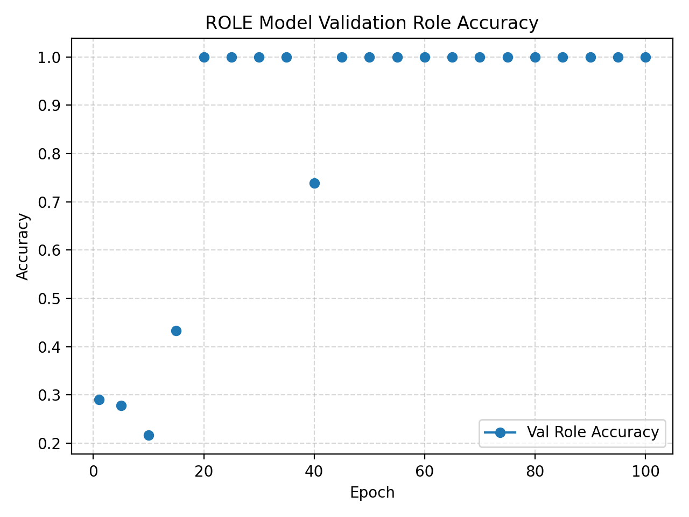
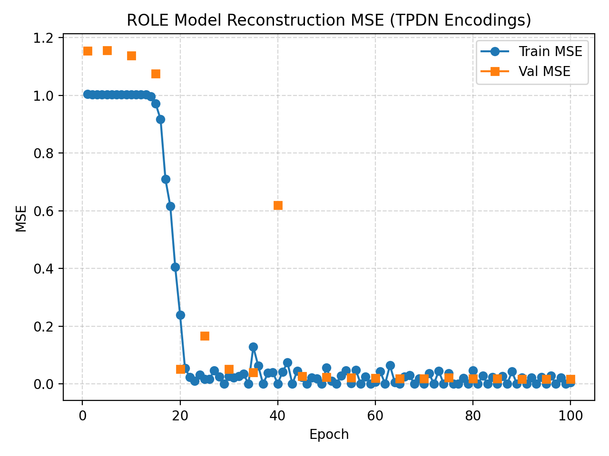
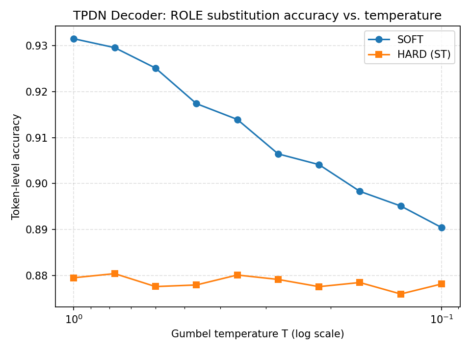

# ROLE: Role-Learning Tensor Product Encoder

## Overview

This repository implements a **ROLE** (Role-Learning) encoder — a neural model that learns to represent sequences as **Tensor Product Representations (TPRs)** by discovering latent structural roles for each element in a sequence. The model is trained to approximate the encodings produced by a fixed Tensor Product Decomposition Network (TPDN), which uses predefined, hand-crafted role schemes (e.g. left-to-right positional roles).

Our implementation is based on the ROLE model introduced by **Soulos et al. (2020)**, which demonstrated that an LSTM-based architecture could learn to approximate TPDN encodings purely from data, without pre-specifying how positional roles are assigned. The key innovation of the original ROLE model is that roles are *learned*, not given — the network discovers, through training, what structural decomposition best explains the sequences it sees.

This implementation replaces the original LSTM-based role assigner with a **Transformer encoder**, and features two key mechanisms to improve training performance — **temperature annealing** and **entropy regularisation** — to stabilise the softmax role assignment distributions.


---

## Key Modifications from Soulos et al. (2020)

### 1. Transformer Role Assigner

The original ROLE model used a **bidirectional LSTM** to assign roles. Our implementation uses a **Transformer encoder**. 

### 2. Elimination of One-Hot and L2 Regularisation

The original ROLE model included two auxiliary regularisation terms:

- **One-hot regularisation:** penalised soft, spread-out role distributions; encouraged sharply peaked assignments.
- **L2 regularisation:** penalised role probability vectors that deviated from a uniform distribution.

In our implementation, **both of these terms are disabled** by setting their weights to zero in `RoleLearningTensorProductEncoder`:

```python
one_hot_regularization_weight=0.00,
l2_norm_regularization_weight=0.00,
```

These terms were found to be unnecessary — and potentially harmful to training stability. The unique-role regularisation term (which encourages different positions to use different roles) is retained with an increased weight of 1.2.

### 3. Temperature Annealing

To stabilise softmax role assignments during training, a **temperature annealing schedule** is applied. Temperature is initialised at 5.0 and exponentially decayed to 0.5 over the course of training, implemented in the `get_temperature()` function in `role_approx.py`.

Early in training, high temperature encourages exploration of the role space with soft, distributed assignments. As training progresses, lower temperature causes the model to commit to more discrete role decisions, improving interpretability and alignment with the one-hot structure of the TPDN's fixed role scheme.

The temperature is passed directly into the `forward()` method of `RoleLearningTensorProductEncoder`, which propagates it to the `RoleAssignmentTransformer`.

### 4. Entropy Regularisation

In place of the one-hot regularisation term, we use an **entropy regularisation loss** to encourage confident role assignments. Minimising entropy encourages the model to assign each sequence position to a single, well-defined role rather than hedging across multiple roles. The entropy weight is set to `ENTROPY_WEIGHT = 0.01` in `role_approx.py`.

This approach directly penalises distributional uncertainty.

---

## Training Procedure (`role_approx.py`)

### Objective

The TPDN encodings used to train the ROLE model were generated using a toy dataset of 50,000 random number sequences of length 6. The ROLE model is trained to **minimise the MSE between its TPR encoding and the target TPDN encoding** for the same input sequence. TPDN encodings are pre-computed using a fixed role scheme (e.g. left-to-right positional roles) and stored as JSON. The total training loss combines three terms:

- **MSE loss** ($\mathcal{L}_\text{MSE}$): the primary reconstruction objective, measuring the mean squared error between the ROLE model's output encoding and the corresponding TPDN target encoding. Encoding targets are **standardised** (zero mean, unit variance per feature) before computing the MSE, improving numerical stability across the high-dimensional encoding space.
- **Entropy loss** ($\mathcal{L}_\text{entropy}$, weight 0.01): penalises high-entropy (uncertain) role assignment distributions, encouraging the model to commit each sequence position to a single well-defined role rather than spreading probability mass across many roles.
- **Unique-role loss** ($\mathcal{L}_\text{unique}$, weight 1.2): penalises multiple positions within the same sequence being assigned the same role, encouraging a diverse and non-redundant role decomposition.

### Optimiser and Schedule

- **Optimiser:** Adam, `lr = 1e-3`
- **Epochs:** 100
- **Batch size:** 16

### Data Split

Data is split 80/20 into training and test sets. Validation is run every 5 epochs (plus the first and final epoch).

### Checkpoint Selection
 
Model checkpoints are selected using a **combined score** that balances reconstruction quality and role assignment accuracy:
 
$$\text{score} = \text{val MSE} + \lambda_{\text{acc}} \cdot (1 - \text{acc aligned})$$
 
with $\lambda_{\text{acc}} = 10.0$. Once aligned role accuracy reaches 99%, the selection criterion switches to pure validation MSE, allowing continued optimisation of encoding quality after role assignments have effectively converged.
 
Role assignment accuracy is computed using the **Hungarian algorithm** to find the optimal alignment between predicted and ground-truth role labels, accounting for arbitrary label permutations in the learned role space.

---
 
## Results
 
Reported below are results across three metrics: validation role assignment accuracy, reconstruction MSE relative to TPDN encodings, and substitution accuracy.
 
### Role Assignment Accuracy
 

 
Role assignment accuracy starts low (~0.29) in the first few epochs as the model explores the role space under high temperature. It rises sharply between epochs 15 and 20, reaching perfect accuracy (1.0) by epoch 20 and remaining stable thereafter. This transition coincides with the temperature schedule bringing assignments toward more discrete decisions, demonstrating that temperature annealing effectively drives the model to commit to well-defined role structures.
 
### Reconstruction MSE
 

 
Training and validation MSE remain near 1.0 for the first ~15 epochs, then drop sharply as role assignments crystallise, falling below 0.1 by epoch 20. Both curves converge to near zero by epoch 25 and remain stable for the remainder of training, indicating that once roles are correctly assigned, the model quickly learns to reproduce the TPDN encodings with high fidelity. The validation MSE spike at epoch 40 is a transient fluctuation that does not persist.
 
### Substitution Accuracy
 

 
Substitution accuracy measures how well the ROLE model's encodings can be decoded back to the original number sequence by a separately trained TPDN decoder, evaluated using Gumbel-Softmax sampling across a range of temperatures. Soft Gumbel sampling achieves ~93% token-level accuracy at T=1.0, declining gradually to ~89% at lower temperatures. Hard (straight-through) Gumbel sampling is more stable across temperatures, plateauing at ~88% throughout. The consistently high accuracy under both sampling regimes confirms that the ROLE model produces encodings that are functionally compatible with the TPDN's representational structure.
 
---

## References

- Soulos, P., McCoy, R. T., Linzen, T., & Frank, R. (2020). [Discovering the Compositional Structure of Vector Representations with Role Learning Networks](https://aclanthology.org/2020.blackboxnlp-1.23.pdf). *Proceedings of the Third BlackboxNLP Workshop on Analyzing and Interpreting Neural Networks for NLP.*
- McCoy, R. T., Linzen, T., Dunbar, E., & Smolensky, P. (2019). [RNNs implicitly implement tensor product representations](https://hal.science/hal-02274498/). *Proceedings of ICLR 2019.*
